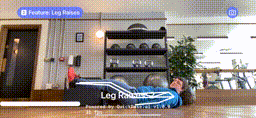
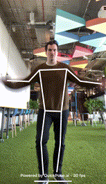
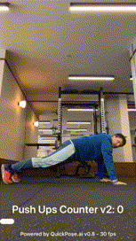
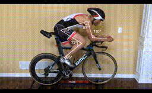

# quickpose-android-sdk


[](https://github.com/apple/swift-package-manager)

QuickPose provides developer-oriented cutting edge ML features of MediaPipe and BlazePose, with easy integration and production ready code, which dramatically improves the speed of implementation of pose estimation, skeleton tracking and fitness counting features into mobile applications. 

See our [Features](#features) below or [checkout our full documentation](https://docs.quickpose.ai/docs/MobileSDK)  on our website [docs.quickpose.ai/docs/MobileSDK](https://docs.quickpose.ai/docs/MobileSDK)

| Range Of Motion Example | Leg Raises Counter Example | 
| --------------- |:-----------------:| 
| | |

<!-- START doctoc generated TOC please keep comment here to allow auto update -->
<!-- DON'T EDIT THIS SECTION, INSTEAD RE-RUN doctoc TO UPDATE -->

- [Register an SDK Key](#register-an-sdk-key)
- [How it works](#how-it-works)
- [Features](#features)
- [Meta Features](#meta-features)
- [Supported Platforms](#supported-platforms)
- [Requirements](#requirements)
- [Documentation](#documentation)

<!-- END doctoc generated TOC please keep comment here to allow auto update -->

Register an SDK Key
------------------

Get your free SDK key on [https://dev.quickpose.ai](https://dev.quickpose.ai), usage limits may apply. 
SDK Keys are linked to your bundle ID, please check Key before distributing to the Play Store.

How it works
------------------

QuickPose process a video frame and makes it easy for developers to perform complex AI features to the image, such as overlaying markings to the output image to highlight the user's pose.

```swift
+----------+          +-------------+          +-----------------+
|          |          |             |          |  Overlay View   |
|  Camera  |--------->|  QuickPose  |--------->|        +        |
|          |          |             |          |     Results     |
+----------+          +-------------+          +-----------------+
```

Features
------------------

| Feature       | Example       | Supported |
| ------------- |:-------------:| ---------:|
| Joint Positions  |  | v0.1        |
| <p><b>Overlays</b></p><p>Whole Body</p><p>Upper Body</p><p>Lower Body</p><p>Shoulder</p><p>Left Arm</p><p>Right Arm</p><p>Left Leg</p><p>Right Leg</p>       |   | v0.1        |
| <p><b>Health - Range Of Motion</b></p><p>Left Shoulder</p><p>Right Shoulder</p><p>Left Hip</p><p>Right Hip</p><p>Left Knee</p><p>Right Knee</p><p>Back</p><p>Neck</p>       |    | v0.1      |
| <p><b>Fitness - Exercise Detection & Counter</b></p><p>Squat</p><p>Sumo Squat</p><p>Jumping Jack</p><p>Push Up</p> <p>Plank</p> <p>Cobra Wings</p>   <p>Left Leg Lunge</p><p>Right Leg Lunge</p><p> SitUps</p><p> CobraWings</p><p> Plank</p><p>Leg Raises</p><p>Glute Bridge</p><p>Overhead Dumbbell Press</p><p>vUps</p><p>Lateral Raises</p><p>Front Raises</p><p>Hip Abduction Standing Left</p><p>Hip Abduction Standing Right</p><p>Side Lunges Left</p><p>Side Lunges Right</p><p> Biceps Curls</p>|   | v0.3|     
   

Meta Features
------------------

| Feature       | Example       | Supported |
| ------------- |:-------------:| ---------:|
| Stacked Feature Styling | <br />[<small>Bike Side View Video by Tariq Ali</small>](https://www.youtube.com/watch?v=LRA4N5cGnLU) | v0.1 |   
| Conditional Styling |   | v0.1 |   


Min Version Requirements
------------------

- Android SDK 26

Installing the SDK
------------------

### Install Android Libraries

In your app's `build.gradle`, copy the quickpose dependencies

```gradle
dependencies {
    // recommended for starting quickpose
    implementation ("androidx.lifecycle:lifecycle-runtime-ktx:2.6.1'")
    
    // CameraX core library
    val camerax_version = ("1.4.1")
    
    implementation("androidx.camera:camera-core:$camerax_version")
    implementation("androidx.camera:camera-camera2:$camerax_version")
    implementation("androidx.camera:camera-lifecycle:$camerax_version")
    implementation("androidx.camera:camera-view:$camerax_version")

    implementation("com.google.flogger:flogger:latest.release")
    implementation("com.google.flogger:flogger-system-backend:latest.release")
    implementation("com.google.guava:guava:27.0.1-android")
    implementation("com.google.protobuf:protobuf-javalite:3.19.1")

    implementation("com.microsoft.onnxruntime:onnxruntime-android:latest.release")
    implementation("ai.quickpose:quickpose-mp:0.1")
    implementation("ai.quickpose:quickpose-core:0.7")
}

```


Getting Started
------------------

See code examples below or download our [Sample Apps](/SampleApps).


__Step 1__: Download/Clone Repo

__Step 2__: Open Basic Demo

__Step 3__: Build to your device

__Step 4__: Run

__Step 5__: Explore the features and returned results

```kotlin
quickPose.start(
    arrayOf(
        Feature.Overlay(group = Landmarks.Group.Arm(Side.LEFT))
    ),
    onFrame = { status, overlay, features, feedback, landmarks ->
    	println("$status, $features")
    }
 )               
```


Documentation
------------------
Checkout our full documentation at [https://docs.quickpose.ai/docs/MobileSDK](https://docs.quickpose.ai/docs/MobileSDK)
